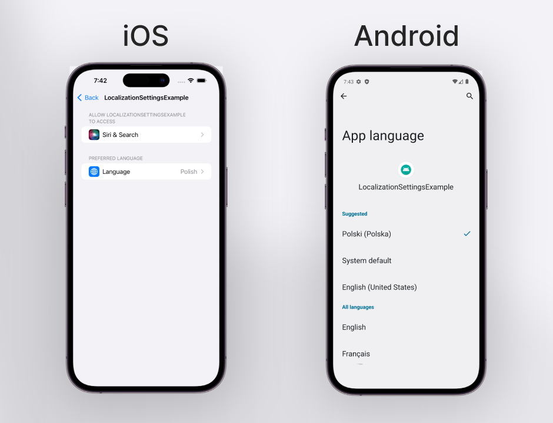
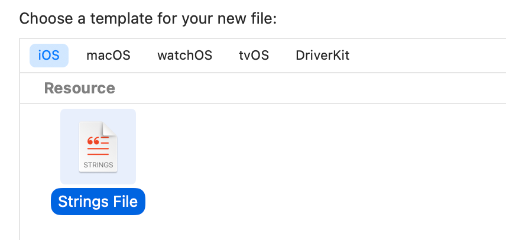

# React Native Localization Settings

`react-native-localization-settings` is a native module to expose per-app language preferences API on iOS and Android.



## Supported platforms

| Platform | Supported |
|----------|:---------:|
| iOS      |     ✅     |
| Android* |     ✅     |

_*per-app language settings was introduced in API level 33 (Android 13). On the older versions, the library uses
SharedPreferences to store the language._

## Installation

To get started with `react-native-localization-settings`, you'll need to install it using npm:

```sh
npm install react-native-localization-settings
```

or with yarn:

```sh
yarn add react-native-localization-settings
```

## API

### getLanguage()

Function to get current language.

Returns Language in IETF BCP 47 format (like 'en-US')

```ts
getLanguage(); // 'en-US'
```

### setLanguage()

Function to set the current language.
It accepts a string with language code in IETF BCP 47 format (like 'en-US') or ISO 639-1 format (like 'en').

```ts
setLanguage("en-US");
```

## i18next

This library is fully compatible with [i18next](https://www.i18next.com/).
To use it with i18next, you need to use `ReactNativeLanguageDetector` before init function:

```ts
import { ReactNativeLanguageDetector } from 'react-native-localization-settings';

i18next
  .use(ReactNativeLanguageDetector)
  .use(initReactI18next)
  .init({
    // ...
  });
```

Then, if you want to create custom in-app language selector, you should be able to change the language (along with the
settings per-app language) using standard i18next function:

```ts
i18next.changeLanguage('pl-PL');
```

## Define supported languages

To get started, you'll need to define the languages that your app supports.

### iOS

Open your project in XCode, in Project Navigator select project, go to `Info` tab, and
under `Localizations` section add languages you want to support.


Next, you need to create a `Localization.strings` file.



Select newly created file and on the right side of the screen, under `Localizations` selection press `Localize`. Confirm
the popup.


Lastly, you need to select all elements in the section form previous step.

### Android

Create new file in `android/app/src/main/res/xml` directory named `locales_config.xml`. and define supported languages:

```xml
<?xml version="1.0" encoding="utf-8"?>
<locale-config xmlns:android="http://schemas.android.com/apk/res/android">
  <locale android:name="en"/>
  <locale android:name="pl"/>
  <locale android:name="fr"/>
</locale-config>
```

Then, open `android/app/src/main/AndroidManifest.xml` and add following line to the Application tag:

```xml
<application
        android:name=".MainApplication"
        android:localeConfig="@xml/locales_config" <!-- this line -->
>
```

## Why?

Users who speak multiple languages often set their device language to one language, such as English, but they may want
to use other languages for certain apps, like Polish, Dutch, or French. To help apps provide a better experience for
these users, this package adds the ability to set language preferences for individual apps in the device's settings.

## License

[MIT](LICENSE)

---

Made with ❤️ by [Jakub Grzywacz](https://jakubgrzywacz.pl)
